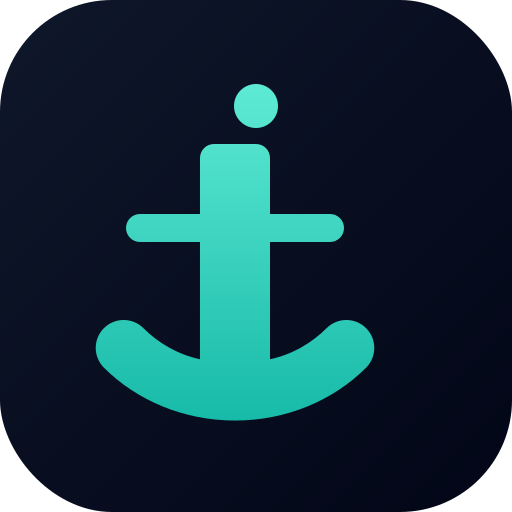
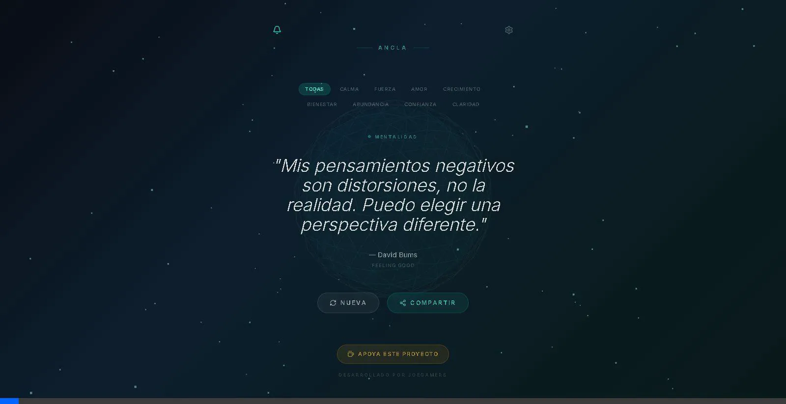

  
  <h1>Ancla — Tu Espacio de Calma</h1>
  
<b>Interrumpe pensamientos negativos, reprograma tu mente y encuentra tu centro.</b>

  

    <a href="https://anclas.vercel.app"><b>🚀 Usar App Web</b></a> •
    <a href="#-instalación"><b>📱 Instalar PWA</b></a> •
    <a href="https://ko-fi.com/joegamersdev"><b>☕ Apoyar Proyecto</b></a>
  

---

## ✨ ¿Qué es Ancla?

**Ancla** no es solo una app de frases; es una herramienta de **enclajamiento cognitivo** diseñada para ser tu refugio digital. Combina la psicología cognitiva moderna (TCC) con sabiduría profunda para ayudarte a detener espirales de ansiedad y negatividad.

En un mundo de distracciones, Ancla te ofrece un momento de respiración, una verdad poderosa y un entorno visual que calma tus sentidos.

## 🚀 Características Principales

- 🌊 **Entorno Zen Inmersivo**: Fondo animado en 3D con Three.js que simula una respiración tranquila.
- 🧠 **+100 Afirmaciones de Calidad**: Curadas bajo criterios psicológicos y bíblicos para fortalecer tu identidad y paz.
- 🔔 **Notificaciones Inteligentes**: Recibe dosis de luz durante el día con una frecuencia personalizada.
- 📤 **Comparte la Luz**: Genera imágenes hermosas con tus afirmaciones favoritas para inspirar a otros en redes sociales.
- 📱 **Experiencia PWA**: Instálala en tu iPhone o Android como una app nativa, sin ocupar espacio y con acceso offline.

## 📸 Showcase

  
  

## 🛠️ Stack Tecnológico

- **Frontend**: React 19 + TypeScript + Vite
- **Gráficos**: Three.js (3D Zen Background)
- **Estilos**: Tailwind CSS + Framer Motion (Animaciones suaves)
- **Nativo/PWA**: Capacitor + Vite PWA Plugin
- **Estado**: Zustand (Ligero y rápido)

## 📲 Instalación

Ancla es una **PWA (Progressive Web App)**. No necesitas la Play Store:

1. Visita [anclas.vercel.app](https://anclas.vercel.app)
2. **Android**: Toca el aviso "Instalar aplicación" o ve al menú de Chrome → "Instalar app".
3. **iOS**: En Safari, toca "Compartir" (cuadrado con flecha) y selecciona **"Añadir a la pantalla de inicio"**.

---

## 👨‍💻 Desarrollador

Creado con ❤️ por **[JoeGamers Dev](https://github.com/joegamers)**. 
Si esta herramienta te ayuda, considera invitarme a un café para seguir mejorando Ancla.

---
## 📄 Licencia

Este proyecto es de código cerrado y propiedad exclusiva de **JoeGamers Dev**. No se permite el uso, copia, modificación o distribución del código fuente sin autorización previa. Consulta el archivo [LICENSE](LICENSE) para más detalles.

---

  © 2026 Ancla App. Tu paz es nuestra prioridad.

